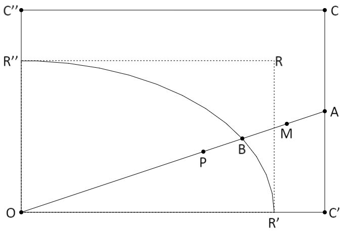
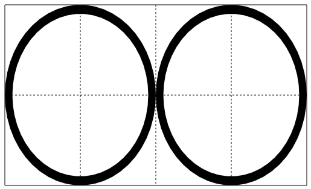

The *[Eyes.elm](Eyes.elm)* program shows two simple eyes, consisting
of only the eye borders and pupils. The size of the eyes and the
position of the pupils are dynamic. The eye size depends on the window
size. The pupils positions depend on the position of the mouse
pointer. Before continuing, take a look at the working program
[here](Eyes.html), to get the idea.

The code is divided into three modules:

 * `EyesView`
 * `EyesModel`
 * `Eyes`

We start our analysis with the `EyesView` module defined in the
*[EyesView.elm](EyesView.elm)* file:

% EyesView.elm
      {-
        This module contains functions which draw
        the eyes.
      -}
      module EyesView where

      import Color (black, white)
      import Graphics.Collage (Form, collage, filled, group, move, moveX, oval)
      import Graphics.Element (Element)

      eyeBorder : Float -> Float -> Form
      eyeBorder w h =
          group [
              filled black <| oval w h,
              filled white <| oval (w*9/10) (h*9/10)
          ]

      eyePupil : Float -> Float -> Form
      eyePupil w h = filled black <| oval w h

      eyesView : (Int, Int) -> (Float, Float, Float, Float) -> Element
      eyesView (w, h) (xPl, yPl, xPr, yPr) =
          let xC = (toFloat w) / 4
              yC = (toFloat h) / 2
          in
              collage
                  w
                  h
                  [
                      eyeBorder (2*xC) (2*yC) |> moveX (-xC),
                      eyeBorder (2*xC) (2*yC) |> moveX xC,
                      eyePupil (xC/5) (yC/5) |> move (xPl,yPl),
                      eyePupil (xC/5) (yC/5) |> move (xPr,yPr)
                  ]

      -- test
      main = eyesView (700, 500) (-50, -50, 100, 100)

Before the module declaration we have included a multi-line comment.
Such comments are delimited by the `{-` and `-}` pairs of characters.

The `eyeBorder` function takes two numbers representing the width and
height of the eye and draws the eye border by drawing two ovals on top
of each other: a black one is bigger and is placed below, while the
white one is smaller and is drawed on top of the black one. The `oval`
function creates an oval shape, given its two dimentions. The `group`
function creates a `Form` from a list of `Form` values. Thanks to
that, the created `Form` can be manipulated as one unit. The
`eyePupil` function draws an oval representing the pupil. The
`eyeView` function draws the eyes (two eye borders and two pupils) and
returns the result as an `Element`. The `eyeView` function takes two
arguments: a pair of values representing the width and height of the
resulting `Element`, and a 4-element tuple containing the coordinates
of both pupils.

It is no accident that we have implemented the drawing functions in a
separate module. That allows us to define a `main` function for
testing purposes. That `main` function will not be used by our
program, since our program’s `main` function is defined in the `Eyes`
module. We are thus free to use the `main` function of the `EyesView`
module for testing — we use it to call the `eyesView` function with
test arguments and after compiling the module, we can
[verify](EyesView.html) the result in the browser.

The definition of the `main` function is preceded with a one line
comment. The beginning of the comment is denoted by two `-` (minus)
characters.

The main difficulty of the example is calculating the pupils
coordinates based on the coordinates of the mouse pointer. The
mathematical algorithm of that calculation is implemented in the
`EyesModel` module defined in the *[EyesModel.elm](EyesModel.elm)*
file. Again, it is no accident that we use a separate module. By
implementing in the `EyesModel` module only functions, which do not
handle signals and do not handle graphics, we can use the *elm-repl*
tool to import the module functions and test them.

Before implementing the calculation of pupils coordinates, we will
first solve a simpler problem. Let’s consider only a quater of one eye
and let’s solve the problem of calculating the pupil coordinate under
the assumption, that the mouse pointer is located within that
quoter. Consider the following picture.

<!--
"""

picture1 = collage 680 480
  [ outlined defaultLine (rect 600 400)
  , outlined defaultLine (oval 1000 600) |> move (-300,-200)
  , filled white (rect 680 80) |> moveY -241
  , filled white (rect 80 480) |> moveX -341
  , outlined (dotted black) (rect 500 300) |> move (-50,-50)
  , toForm (fromString "R’" |> Text.height 30 |> leftAligned) |> move (200,-220)
  , toForm (fromString "R’’" |> Text.height 30 |> leftAligned) |> move (-320,100)
  , toForm (fromString "R" |> Text.height 30 |> leftAligned) |> move (210,100)
  , filled black (circle 4) |> move (-300,-200)
  , toForm (fromString "O" |> Text.height 30 |> leftAligned) |> move (-320,-200)
  , filled black (circle 4) |> move (300,200)
  , toForm (fromString "C" |> Text.height 30 |> leftAligned) |> move (320,200)
  , filled black (circle 4) |> move (300,-200)
  , toForm (fromString "C’" |> Text.height 30 |> leftAligned) |> move (320,-200)
  , filled black (circle 4) |> move (-300,200)
  , toForm (fromString "C’’" |> Text.height 30 |> leftAligned) |> move (-320,200)
  , traced defaultLine (path [(-300,-200),(300,0)])
  , filled black (circle 4) |> move (300,0)
  , toForm (fromString "A" |> Text.height 30 |> leftAligned) |> move (320,0)
  , filled black (circle 4) |> move (225,-25)
  , toForm (fromString "M" |> Text.height 30 |> leftAligned) |> move (225,-43)
  , filled black (circle 4) |> move (137,-54)
  , toForm (fromString "B" |> Text.height 30 |> leftAligned) |> move (137,-74)
  , filled black (circle 4) |> move (60,-80)
  , toForm (fromString "P" |> Text.height 30 |> leftAligned) |> move (60,-100)
  ]
-->

Point *O* is the center of the eye, and the *R’R’’* arc is the
internal eye border. The *OC’CC’’* rectangle is the area where we
assume the mouse pointer to be. Let *M* be the point where it is
currently located. Point *A* is where the *OM* line crosses the
*OC’CC’’* rectangle and point *B* is where it crosses the *R’R’’*
arc. Our goal is to calculate the coordinates of point *P* placed on
the *OMA* line, such that the following proportion holds:

      OP/OB = OM/OA

Points *R*, *C*, and *M* are given.  The coordinates of *M* can be
derived from the `Mouse.position` signal. The coordinates of *R* and
*C* — from the `Window.dimensions` signal.

We will use the following convention: for any point *Z*, we will
denote its *x* and *y* coordinates by *xZ* and *yZ*. For example, *xP*
and *yP* will denote the coordinates of the point P.

From the above proportion, we get the following equations describing
the proportions between the *x* and *y* coordinates:

      xP/xB = xM/xA
      yP/yB = yM/yA

We can therefore calculate xP and yP as follows:

      xP = xB×xM/xA
      yP = yB×yM/yA

The values *xM* and *yM* are given. We need to calcualte the other
values on the right hand sides of both equations. Let us first
consider the coordinates of the point *A*.

Since points *O*, *M* and *A* are on the same line, we know that the
following holds true:

      xM/yM = xA/yA

We also know, that point *A* must be either between *C* and *C'* or
between *C* and *C’’*. In the former case (which happens when yM/xM is
smaller than yC/xC) we know that *xA* is equal to *xC*. We can thus
calculate *yA* as follows:

      yA = xC×yM/xM

In the latter case, *yA* is equal to *yC*, and we can calculate *xA*
as follows:

      xA = xM*yC/yM

We still need to calculate the coordinates of *B*. Since *B* is a
point on an ellipsis, we can use the algebraic equation for elliptical
schapes:

      xB²/xR² + yB²/yR² = 1

After multiplying both sides by xR²×yR² we get:

      xB²×yR² + yB²×xR² = xR²×yR² ①

Since points *O*, *M* and *B* are on the same line, we know that the
following holds true:

      xM/yM = xB/yB

and consequently:

      xB = yB×xM/yM
      yB = xB×yM/xM

By substituting *xB* and *yB* in ① and solving the equations, we get
the formulas for calculating *xB* and *yB*:

      xB = xR*yR / sqrt(yR²+xR²*yM²/xM²)
      yB = xR×yR / sqrt(xR²+yR²×xM²/yM²)

The `calculateP` function from the `EyesModel` module implements the
calculations:

% EyesModel.elm
      module EyesModel where

      calculateP : (Float, Float) -> (Float, Float) -> (Float, Float) -> (Float, Float)
      calculateP (xR, yR) (xC, yC) (xM, yM) =
          let (xA, yA) =
                  if (yM/xM < yC/xC)
                      then (xC,xC*yM/xM)
                      else (xM*yC/yM,yC)
              xB = xR*yR / sqrt (yR^2+(xR*yM/xM)^2)
              yB = xR*yR / sqrt (xR^2+(yR*xM/yM)^2)
              xP = xB*xM/xA
              yP = yB*yM/yA
          in
              (xP,yP)

For testing purposes, we can call the function with some example
arguments using `elm-repl`:

      > import EyesModel (calculateP)
      > calculateP (200,100) (500,100) (10,10)
      (8.94427190999916,8.94427190999916) : (Float, Float)

We must now calculate the coordinates of both pupils based on the
width and height of the screen, and the mouse pointer coordinates.  We
will draw the eyes such that they fill the whole available window
area. Each eye will fill half of the available area. We will thus have
8 quaters of an eye that we have to handle, as illustrated on the
following picture.

<!--
"""

--    xB²×yR² + yB²×xR² = xR²×yR² ①
--    xB²×yR² + xB²×xR²×yM²/xM² = xR²×yR²
--    xB²×(yR² + xR²*yM²/xM²) = xR²*yR²
--    xB² = xR²*yR² / (yR² + xR²*yM²/xM²)
--    xB²×yR² + yB²×xR² = xR²×yR² ①
--    yR²×yB²×xM²/yM² + yB²×xR² = xR²×yR² ①
--    yB²×(yR²×xM²/yM² + xR²)  = xR²×yR²

picture2 = collage 502 302
  [ outlined defaultLine (rect 500 300)
  , filled black (oval 250 300) |> moveX -125
  , filled white (oval (250*9/10) (300*9/10)) |> moveX -125
  , filled black (oval 250 300) |> moveX 125
  , filled white (oval (250*9/10) (300*9/10)) |> moveX 125
  , traced (dotted black) (path [(-250,0),(250,0)])
  , traced (dotted black) (path [(-125,-150),(-125,150)])
  , traced (dotted black) (path [(0,-150),(0,150)])
  , traced (dotted black) (path [(125,-150),(125,150)])
  ]
-->

Thus, the *xC* size will be equal to one-fourth of the window width,
and *yC* will be equal to half of the window height. The *xR* and *yR*
values will be set to *9/10* of *xC* and *yC* respectively. The
`pupilsCoordinates` function calculates the coordinates of both
pupils. It calls `calculateP` with parameters adjusted depending on
which area of the screen the mouse pointer is. The function returns a
4-elements tuple containing the coordinates of both pupils.
% EyesModel.elm

      pupilsCoordinates : (Int, Int) -> (Int, Int) -> (Float, Float, Float, Float)
      pupilsCoordinates (w, h) (x, y) =
        let xC = (toFloat w)/4
            yC = (toFloat h)/2
            xM = toFloat x
            yM = (toFloat (h-y)) - yC
            xR = xC*9/10
            yR = yC*9/10
            sign x = x / (abs x)
            (xPr,yPr) =
                if xM >= 3*xC
                    then calculateP (xR,yR) (xC,yC) (xM-3*xC,yM)
                             |> \\(xP,yP) -> (xP+xC, yP * sign yM)
                    else calculateP (xR,yR) (3*xC,yC) (3*xC-xM,yM)
                        |> \\(xP,yP) -> (xC-xP, yP * sign yM)
            (xPl,yPl) =
                if xM >= xC
                    then calculateP (xR,yR) (3*xC,yC) (xM-xC,yM)
                             |> \\(xP,yP) -> (xP-xC, yP * sign yM)
                    else calculateP (xR,yR) (xC,yC) (-xM+xC,yM)
                             |> \\(xP,yP) -> (-xP-xC, yP * sign yM)
        in
            (xPl,yPl,xPr,yPr)

What is left is the `Eyes` module that assembles the program modules
together:

% Eyes.elm
      module Eyes where

      import EyesModel (..)
      import EyesView (..)
      import Mouse
      import Signal
      import Window

      main = Signal.map2 eyes Window.dimensions Mouse.position

      eyes (w,h) (x,y) = eyesView (w,h) (pupilsCoordinates (w,h) (x,y))

It imports the `Mouse` and `Window` modules, because we are using
signals form both of them. And it imports the functions from the
`EyesView` and `EyesModel` modules. The `main` function combines the
`eyes` function with the `Window.dimensions` and `Mouse.position`
signals, and the `eyes` function uses `pupilsCoordinates` to make the
calculations for given window dimensions and mouse positions.

The next chapter introduces time related
signals.
